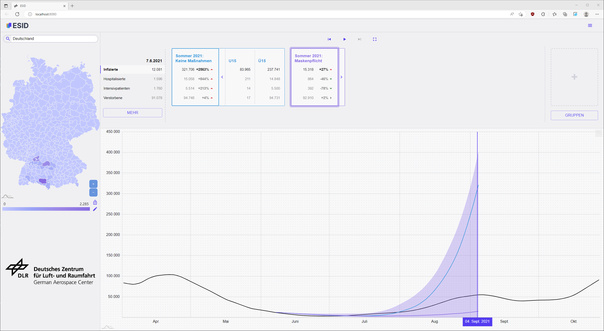

<!--
SPDX-FileCopyrightText: 2024 German Aerospace Center (DLR)
SPDX-License-Identifier: CC-BY-4.0
-->

<p align="center"> 
  
</p>

<p align="center"> 
  
</p>

# ESID - Epidemiologisches Simulationstool für den Infektionsschutz in Deutschland
ESID is a visualization of infectious disease propagation developed at the [German Aerospace Center (DLR)](https://www.dlr.de/).
It allows displaying historical data, as well as analyzing simulation results of pandemics.


## Table of Contents
- [Features](#features)
- [Developer Documentation](#developer-documentation)
- [Contributing to ESID](#contributing-to-esid)
  - [Branching Guidelines](#branching-guidelines)
  - [Git Commit Messages](#git-commit-messages)
  - [Forking ESID](#forking-esid)
- [Contributor Covenant Code of Conduct](#contributor-covenant-code-of-conduct)
  - [Our Pledge](#our-pledge)
  - [Our Standards](#our-standards)
  - [Our Responsibilities](#our-responsibilities)
  - [Scope](#scope)
  - [Enforcement](#enforcement)
  - [Attribution](#attribution)
- [Current Contributors](#current-contributors)
  - [Previous Contributors](#previous-contributors)
- [License](#license)


## Features
You can find a list of the latest changes in the [changelog](frontend/docs/changelog/changelog-en.md).


## Developer Documentation
You can find the developer documentation for the front- and backend in the corresponding folders:
- [Backend Developer Documentation](backend/README.md)
- [Frontend Developer Documentation](frontend/README.md)


## Contributing to ESID
Whenever you encounter a :beetle: **bug** or have :tada: **feature request**,
report this via [Github issues](https://github.com/DLR-SC/ESID/issues).

We are happy to receive contributions to ESID in the form of **pull requests** via Github.
Feel free to fork the repository, implement your changes and create a merge request to the `develop` branch.
There is a [forking guide](#forking-esid) available to get you started!

### Branching Guidelines
The development of ESID follows a simplified version of **git-flow**: The `main` branch always contains stable code.
New features and bug fixes are implemented in `feature/*` or `fix/*` branches and are merged to `develop` once they are finished.
When a new milestone is reached, the content of `develop` will be merged to `main` and a tag is created.

[Github Actions](https://github.com/DLR-SC/ESID/actions) are used for continuous integration.
All pull requests and pushes to `main` and `develop` are built automatically.

### Git Commit Messages
Commits should start with a Capital letter and should be written in present tense (e.g. __:tada: Add cool new feature__ instead of __:tada: Added cool new feature__).
It's a great idea to start the commit message with an applicable emoji. This does not only look great but also makes you rethink what to add to a commit.
* :tada: `:tada:` when adding a cool new feature
* :wrench: `:wrench:` when refactoring / improving a small piece of code
* :hammer: `:hammer:` when refactoring / improving large parts of the code
* :sparkles: `:sparkles:` when formatting code
* :art: `:art:` improving / adding assets like textures or images
* :rocket: `:rocket:` when improving performance
* :memo: `:memo:` when writing docs
* :beetle: `:beetle:` when fixing a bug
* :green_heart: `:green_heart:` when fixing the CI build
* :heavy_check_mark: `:heavy_check_mark:` when working on tests
* :arrow_up_small: `:arrow_up_small:` when adding / upgrading dependencies
* :arrow_down_small: `:arrow_down_small:` when removing / downgrading dependencies
* :twisted_rightwards_arrows: `:twisted_rightwards_arrows:` when merging branches
* :fire: `:fire:` when removing files
* :truck: `:truck:` when moving / renaming files or namespaces

A good way to enforce this on your side is to use a `commit-hook`. To do this, paste the following script into `.git/hooks/commit-msg`.

``` bash
#!/bin/bash

# regex to validate in commit msg
commit_regex='(:(tada|wrench|hammer|sparkles|art|rocket|memo|beetle|green_heart|arrow_up_small|arrow_down_small|twisted_rightwards_arrows|fire|truck|heavy_check_mark):(.+))'
error_msg="Aborting commit. Your commit message is missing an emoji as described in the contributing guideline."

if ! grep -xqE "$commit_regex" "$1"; then
    echo "$error_msg" >&2
    exit 1
fi
```

And make sure that it is executable:

``` bash
chmod +x .git/hooks/commit-msg
```

### Forking ESID
This is pretty straight-forward. Just click the **Fork** button on the top right of this page. 
Then clone the forked repository, perform your changes, push to a feature branch and create a pull request to ESID's develop branch.

``` bash
git clone git@github.com:<your user name>/ESID.git
cd ESID
git remote add upstream git@github.com:DLR-SC/ESID.git
git checkout develop

git checkout -b feature/your-new-feature
# or
git checkout -b fix/your-bugfix

# ... do and commit your changes!

git push origin feature/your-new-feature
```

When there were changes in ESID's develop branch, you will need to merge those to your fork before creating a pull request:

``` bash
git fetch upstream
git merge upstream/develop
```

Then you can create a pull request on GitHub to ESID's develop branch.


## Contributor Covenant Code of Conduct
### Our Pledge
In the interest of fostering an open and welcoming environment, we as
contributors and maintainers pledge to making participation in our project and
our community a harassment-free experience for everyone, regardless of age, body
size, disability, ethnicity, sex characteristics, gender identity and expression,
level of experience, education, socio-economic status, nationality, personal
appearance, race, religion, or sexual identity and orientation.

### Our Standards
Examples of behavior that contributes to creating a positive environment
include:

* Using welcoming and inclusive language
* Being respectful of differing viewpoints and experiences
* Gracefully accepting constructive criticism
* Focusing on what is best for the community
* Showing empathy towards other community members

Examples of unacceptable behavior by participants include:

* The use of sexualized language or imagery and unwelcome sexual attention or
  advances
* Trolling, insulting/derogatory comments, and personal or political attacks
* Public or private harassment
* Publishing others' private information, such as a physical or electronic
  address, without explicit permission
* Other conduct which could reasonably be considered inappropriate in a
  professional setting

### Our Responsibilities
Project maintainers are responsible for clarifying the standards of acceptable
behavior and are expected to take appropriate and fair corrective action in
response to any instances of unacceptable behavior.

Project maintainers have the right and responsibility to remove, edit, or
reject comments, commits, code, wiki edits, issues, and other contributions
that are not aligned to this Code of Conduct, or to ban temporarily or
permanently any contributor for other behaviors that they deem inappropriate,
threatening, offensive, or harmful.

### Scope
This Code of Conduct applies both within project spaces and in public spaces
when an individual is representing the project or its community. Examples of
representing a project or community include using an official project e-mail
address, posting via an official social media account, or acting as an appointed
representative at an online or offline event. Representation of a project may be
further defined and clarified by project maintainers.

### Enforcement
Instances of abusive, harassing, or otherwise unacceptable behavior may be
reported by contacting the project team at martin.kuehn@dlr.de. All
complaints will be reviewed and investigated and will result in a response that
is deemed necessary and appropriate to the circumstances. The project team is
obligated to maintain confidentiality with regard to the reporter of an incident.
Further details of specific enforcement policies may be posted separately.

Project maintainers who do not follow or enforce the Code of Conduct in good
faith may face temporary or permanent repercussions as determined by other
members of the project's leadership.

### Attribution
This Code of Conduct is adapted from the [Contributor Covenant][homepage], version 1.4,
available at https://www.contributor-covenant.org/version/1/4/code-of-conduct.html

[homepage]: https://www.contributor-covenant.org

For answers to common questions about this code of conduct, see
https://www.contributor-covenant.org/faq


## Current Contributors
German Aerospace Center (DLR):
- Martin Kühn
- Jonas Gilg
- Luca Spataro
- Moritz Zeumer
- Pawandeep Kaur-Betz

### Previous Contributors
German Aerospace Center (DLR):
- Margrit Klitz
- Kerem Balci
- Selma Dahmani
- Laurin Kerkloh

Hochschule für Gestaltung Schwäbisch Gmünd (HfG):
- Julien Stoll
- Valerie Grappendorf

## License
Copyright 2021-2023 German Aerospace Center (DLR)

Licensed under the Apache License, Version 2.0 (the "License");
you may not use this file except in compliance with the License.
You may obtain a copy of the License at

    http://www.apache.org/licenses/LICENSE-2.0

Unless required by applicable law or agreed to in writing, software
distributed under the License is distributed on an "AS IS" BASIS,
WITHOUT WARRANTIES OR CONDITIONS OF ANY KIND, either express or implied.
See the License for the specific language governing permissions and
limitations under the License.
