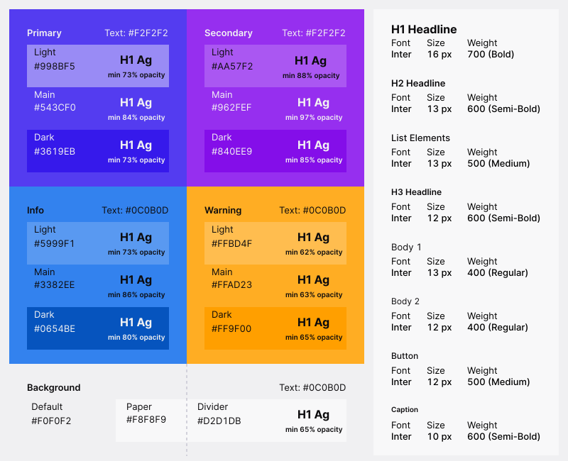

# ESID - Frontend Developer Documentation

## Table of Contents

- [Getting Started](#getting-started)
  - [Prerequisites](#prerequisites)
  - [Initializing](#initializing)
  - [Develop](#development-server)
  - [Running Tests](#running-tests)
  - [Generating Coverage Reports](#generating-coverage-reports)
  - [Formatting Code](#formatting-code)
  - [Linting](#linting)
  - [Building Releases](#building-releases)
- [Technologies](#technologies)
- [Guidelines](#guidelines)
  - [TypeScript](#typescript)
  - [React](#react)
  - [Redux](#redux)
  - [Design and Layout](#design-and-layout)
  - [Testing](#testing)
  - [Documentation](#documentation)
  - [Internationalization](#internationalization)
  - [Code Style](#code-style)

## Getting Started

### Prerequisites

To work with the frontend you need to download and install _Node.js_, and the _Node Package Manager_ (npm). You can
download the latest release from their website: https://nodejs.org/en/

### Initializing

After checking out the repository go to the `frontend` folder and use npm to download the dependencies:

```bash
git clone https://github.com/DLR-SC/ESID.git
cd ESID/frontend
npm install
```

### Development Server

You can set up and start a development server with the command:

```bash
npm run start
```

This will host a server on http://localhost:8080/, where the website will be displayed. After running the command, your
default browser should automatically open with the specified address (Internet Explorer is not supported). Changes to
your code will automatically be compiled, and the website will refresh itself.

### Running Tests

To run tests you can simply use:

```bash
npm run test
```

This will run all tests in the `src/__tests__` folder. The results will be printed to the console, and a JUnit report
will be generated into `reports/jest-junit.xml`. If you want to run a specific test only, you can run:

```bash
npm run test -- -t='deepCopy'       # Runs all deep copy tests.
npm run test -- -t='deepCopy array' # Runs only the deep copy array test.
```

### Generating Coverage Reports

To create a coverage report run:

```bash
npm run coverage
```

The results will be printed to console, and to a clover file in `reports/clover.xml`.

### Formatting Code

To automatically format all code in accordance to our guideline you can run:

```bash
npm run format
```

You should run this before committing.

### Linting

To automatically test code against a subset of our coding conventions you can run:

```bash
npm run lint
```

You should run this before committing.

### Building Releases

Release build can be created with the simple command:

```bash
npm run build
```

The resulting release will be in the `build` folder.

## Technologies

The project makes use of some core technologies and libraries. You should always prefer their features over other
libraries. Also try to learn and keep up with their best practices and guidelines.

- **TypeScript**: Type safety and increasing productivity.
- **React**: Efficient and robust user interface management.
- **Redux**: Efficient and robust state management.
- **Material UI**: Good looking user interface design and responsive layout.

## Guidelines

In general developers should follow the best practices of the libraries they use.

### TypeScript

- Try to write all code in TypeScript. Only resort to JavaScript if it is absolutely necessary.
- Avoid the use `any`. If there is no type information available, create an interface that describes the type.

### React

- Make small individual components that fulfill as small of a role as possible.
- Strongly prefer React-Hooks over class components.

### Redux

Application state management is done using [Redux](https://redux.js.org/). We use the
[Redux Toolkit](https://redux-toolkit.js.org/) to easier work with the framework.
[React Redux](https://react-redux.js.org/) provides the interface between React and Redux.

While it is possible to manage all state with Redux, it should be preferred to use React's `props` functionality to
manage local component state. Redux should only be used, when the state affects large portions of the application that
would be difficult to handle with React's `props` alone.

### Design and Layout

- The frontend should follow the [Material Design guidelines](https://material.io/).
  - The [Material UI](https://material-ui.com/) library does conform to these guidelines. So make use of it as much as
    possible.
  - For icons make use of [Material Icons](https://fonts.google.com/icons).
- The application should always look best in a 16:9 ratio with 1920x1080 and 2560x1440 pixel resolutions.
- The layout should be as responsive as possible, but the previous point has priority.
- The UI should be self describing. To ensure that all functionality can be understood add tooltips to components.
- The frontend uses a global theme based on the following guidelines:
  <details>
  <summary>Design Guidelines for Colors and Typography <i>(-- Click to expand --)</i></summary>
  
  
  
  ** The alternative text color for lighter and darker variants where the contrast is not high enough is always either `#F2F2F2` for light text, or `#0C0B0D` for dark text.**
  </details>
  
  - The theme is provided using the [MUI Theme Provider](https://mui.com/customization/theming "mui.com")
  - <details>
    <summary>It can be accessed in components like this: <i>(-- Click to expand --)</i></summary>
  
    ```typescript
    import {useTheme} from '@mui/material/styles';
    
    export default function MyComponent(): JSX.Element {
      const theme = useTheme();
      
      return (
        <Box
          sx={{
            /*
             * Available theme properties can be found at their declaration inside the App.tsx.
             */
            // accessing theme variables
            background: theme.palette.background.default,
             
            // accessing theme typography
            typography: theme.typography.h1,
            // or
            typography: 'h1',
            
            // accessing theme spacing
            margin: theme.spacing(3),
          }}
        >
        </Box>
      );
    ```
    </details>

### Testing

All code should be tested:

- Pure TypeScript should be tested using unit tests with a 100% coverage.
- UI code should be tested using the react-testing-library.

### Documentation

Code should be documented as much as possible. Each class and function should contain a detailed description of what it
does, what inputs it gets and what outputs it produces. Document only functions that require it. Getters and setters for
example don't to be documented unless they do something unconventional.

### Internationalization

All text in the application should be internationalized with at least German and English support. To internationalize
texts the [react-i18next](https://react.i18next.com/) framework is used.

You can add translations in the `public/locales/<language>/<namespace>.json5` files. The following code snippets show
how to use a translation in a React-Hook.

`public/locales/en/global.json5`:

```json
{
  "helloWorld": "Hello, World!"
}
```

`public/locales/de/global.json5`:

```json
{
  "helloWorld": "Hallo, Welt!"
}
```

`HelloWorld.tsx`:

```tsx
import React from 'react';
import {useTranslation} from 'react-i18next';

export default function HelloWorld(): JSX.Element {
  const {t} = useTranslation();
  return <h1>{t('helloWorld')}</h1>;
}
```

### Accessibility

The application should conform to modern accessibility (a11y) guidelines. We use
[Axe](https://github.com/dequelabs/axe-core) to check for a11y problems. Axe, automatically posts a11y issues in the
console, when they arise. This is only enabled in the development mode with `npm run start`. In production Axe is not
running.

### Code Style

Function names, parameters and variables and class members should be written in `camelCase`. The exception for functions
are React-Hooks, which should be written in `PascalCase`. In addition, classes and interfaces should also be written in
`PascalCase`:

```tsx
function myFunction(myParameter: string) {
  const myVariable = myParameter;
}

function MyHook() {
  return <div>Hello World</div>;
}

interface MyInterface {
  myMember: string;
}

class MyClass {
  myMember: MyInterface;
}
```

Try to use `const` as much as possible and use `let` otherwise. Never use `var`!
